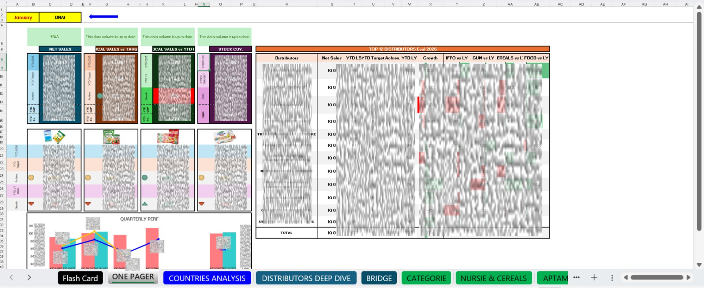
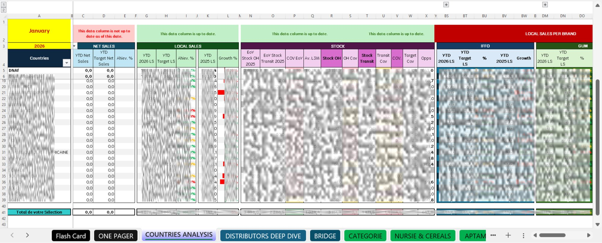
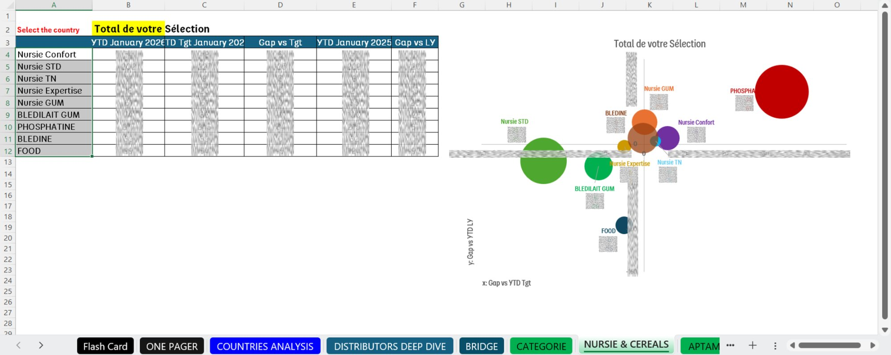

# 📊 Commercial Performance BI Dashboard — Excel

> A fully automated, multi-tab Business Intelligence dashboard built in Excel, designed to monitor **~€120M in commercial performance** across **15+ Sub-Saharan African markets**, **70+ distributors**, and **100+ SKUs across 8 parent brands and 20 sub-brands** — updated monthly and used by **200+ stakeholders** across 6 departments.

---

## 🧠 Business Context

Built and operated during my role as **Senior Commercial Performance & BI Analyst at Danone Sub-Saharan Africa**.

This tool was the **single source of truth** for commercial decision-making across the entire Sub-Saharan Africa scope. It replaced a fragmented, manually-updated reporting system and became the backbone of weekly zone reviews, monthly executive reports, quarterly business reviews (QBR) and annual operating plan (AOP) cycles.

**Departments served:** Commercial · Marketing · Supply Chain · Healthcare · Finance · HR

---

## 🏷️ Brand Architecture Monitored

The dashboard tracks **8 parent brands** broken down into **20 sub-brands** across two nutritional segments:

**Infant Formula & Growing-Up Milk (IFFO / GUM)**

| Parent Brand | Sub-Brands |
|---|---|
| **Nursie** | Nursie Confort · Nursie STD · Nursie TN · Nursie Expertise · Nursie GUM |
| **Blédilait** | Blédilait IFFO · Blédilait GUM |
| **Aptamil** | Aptamil IFFO · Aptamil GUM |
| **Gallia** | Gallia IFFO · Gallia GUM |
| **Bebelac** | Bebelac IFFO · Bebelac GUM |
| **Cow & Gate** | Cow & Gate IFFO · Cow & Gate GUM |
| **AMN** | AMN |

**Complementary Nutrition**

| Parent Brand | Sub-Brands |
|---|---|
| **Phosphatine** | Phosphatine |
| **Blédine** | Blédine |
| **Blédina Food** | Food |

---

## 🗂️ Dashboard Structure — 8 Tabs

### 1. 🗺️ Flash Card — Country-Level Overview
Interactive country selector with a color-coded map of Sub-Saharan Africa (green/red/brown performance coding), monthly performance table vs target and prior year, multi-line stock trend chart (Sell-in / Stock OH / Transit / Sell-out over 14 months), brand-level YTD performance breakdown, and circular gauge indicators for YTD vs Target and YTD vs LY.

---

### 2. 📋 One Pager — Executive Summary
Single-page executive view consolidating: regional KPI cards (Net Sales, Local Sales vs Target/LY, Stock Coverage), Top 12 distributor performance table with brand-split growth (IFFO / GUM / Cereals / Food vs LY), quarterly performance trend chart, and category-level YTD scorecards.

---

### 3. 🌍 Countries Analysis — 35+ Market Scorecard
Full market-by-market matrix covering all 35+ Sub-Saharan African countries with Net Sales (YTD vs Target vs LY), Local Sales achievement %, Stock indicators (OH, Transit, Coverage, Average L3M, Target COV), and brand-split performance columns — all in a single scrollable view with conditional formatting for instant performance reading.

---

### 4. 🏪 Distributors Deep Dive — 70+ Distributor View
Granular distributor-level analysis by country, showing Net Sales, Local Sales, Stock OH, Transit, Coverage and brand-split performance (IFFO / GUM / Cereals / Food vs LY) for every active distributor across the full scope. Enables identification of underperforming distributor-country combinations and stock anomalies.

---

### 5. 🌉 Bridge — Zone Waterfall Analysis
Regional performance bridge charts decomposing YTD performance vs Target and vs LY by zone (Tropical, Indian Ocean, Atlantic, Savannah) and by country within each zone. Enables management to pinpoint exactly which markets are driving or dragging zone performance.

---

### 6. 🔵 Catégorie — Category Bubble Matrix
Interactive bubble chart plotting Gap vs YTD Target (x-axis) against Gap vs YTD LY (y-axis) for each product category (IFFO, GUM, Cereals, Food, AMN), with bubble size proportional to YTD volume. Instantly identifies which categories are growing, declining, or at risk vs both benchmarks simultaneously.

---

### 7. 🍼 Nursie & Céréales — SKU-Level Bubble Analysis
Same bubble matrix logic applied at sub-brand level across the Nursie and Cereals portfolio (Nursie Confort, Nursie STD, Nursie TN, Nursie Expertise, Nursie GUM, Blédilait GUM, Phosphatine, Blédine, Food), enabling brand managers to identify which specific products are over- or under-performing vs target and prior year simultaneously.

---

### 8. 🟦 Aptamil, Gallia, Bebelac & AMN — Premium Portfolio Analysis
Sub-brand level bubble matrix for the premium infant nutrition portfolio (Aptamil IFFO/GUM, Gallia IFFO/GUM, Bebelac IFFO/GUM, Blédilait IFFO, Cow & Gate IFFO/GUM, AMN), supporting healthcare and commercial teams in monitoring medical rep impact and distributor performance on high-value products.

---

## ⚙️ Technical Highlights

| Feature | Detail |
|---|---|
| **Automation** | Fully formula-driven — zero manual input after monthly data load |
| **Interactivity** | Country selector updates Flash Card, bubble charts and category views simultaneously |
| **Conditional formatting** | Color-coded performance signals throughout (green/red/amber) |
| **Stock intelligence** | OH, Transit, Sell-out, Coverage and L3M average tracked simultaneously |
| **Multi-dimensional analysis** | Performance readable by country, zone, distributor, category and sub-brand |
| **Data pipeline** | Fed by the companion VBA ETL macro (see [excel-vba-etl-multifile-compiler](https://github.com/sergenguena1/excel-vba-etl-multifile-compiler)) |

---

## 📈 Business Impact

| Metric | Result |
|---|---|
| Revenue scope monitored | ~€120M |
| Markets covered | 15+ Sub-Saharan African countries |
| Distributors tracked | 70+ |
| Parent brands monitored | 8 |
| Sub-brands monitored | 20 |
| Stakeholders served | 200+ across 6 departments |
| Reporting delivery | From the 22nd → **2nd of the month** |
| Trade spend overspend | Reduced from +30% → **–5%** over 3 years |

---

## 🔗 Related Projects

- **[VBA ETL Multi-File Compiler](https://github.com/sergenguena1/excel-vba-etl-multifile-compiler)** — The automated pipeline that feeds data into this dashboard (processes 70+ distributor files in under 4 minutes)

---

## 👤 Author

**Serge NGUENA** — Senior Commercial Performance & BI Analyst  
[LinkedIn](https://linkedin.com/in/serge-nguena) · Laval, QC · Permanent Resident

*Microsoft Certified: Data Analyst Associate (Power BI)*

---

## 📄 Note on Data

All data visible in the screenshots is real operational data from Danone Sub-Saharan Africa and is shown here strictly for portfolio purposes. No raw data files are published in this repository.
